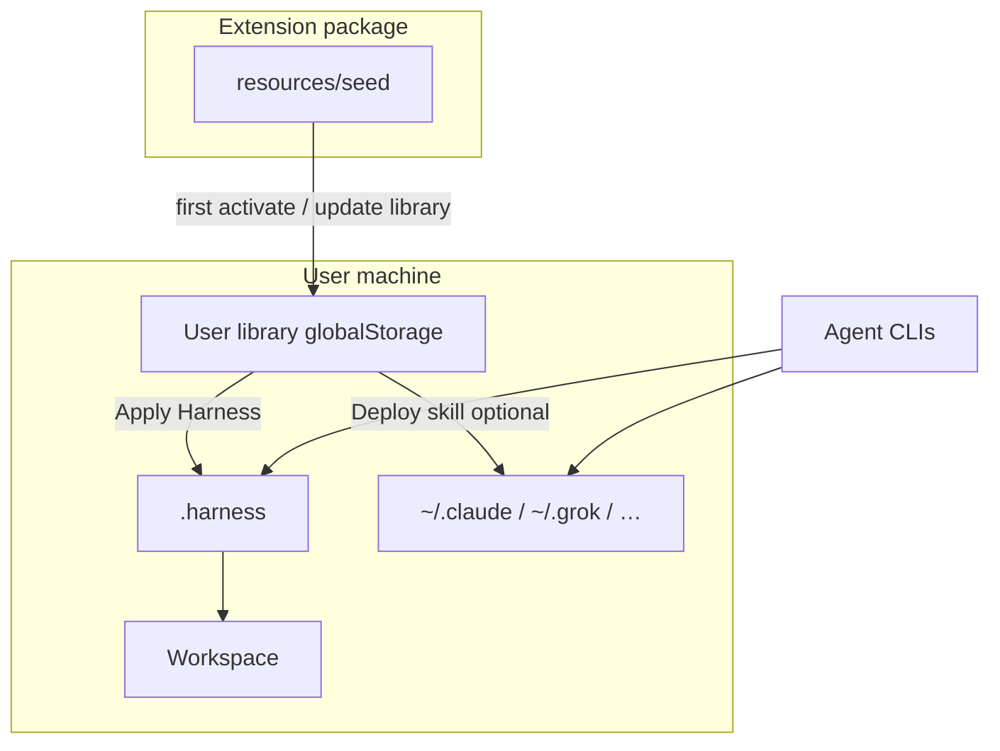
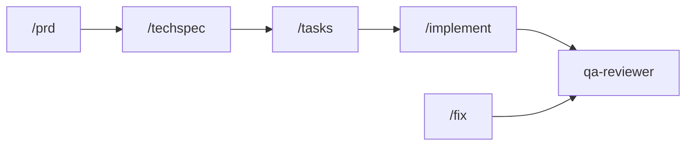

# Context Kit content guide

This document describes **what ships inside Context Kit** (the VS Code extension seed and the portable harness assets it carries), **how pieces relate**, and **how to use them**. It is written for humans and for coding agents.

The portable **asset kit** repository (source of the seed) will be published openly later. Until then, treat `resources/seed/` in this extension as the content pack that users receive.

---

## Mental model



| Layer               | Where                                | Purpose                                                     |
| ------------------- | ------------------------------------ | ----------------------------------------------------------- |
| **Seed**            | `resources/seed/` in the VSIX        | Factory baseline (skills, commands, agents, language packs) |
| **Library**         | VS Code `globalStorage`              | Editable copy the user owns                                 |
| **Project harness** | `.harness/` (gitignored)             | What a given repo uses day to day                           |
| **Project config**  | `.context-kit/project.json` (commit) | Language + providers + options                              |
| **Runtime**         | `~/.claude/skills`, etc.             | Optional mirror for tools that only scan home dirs          |

---

## Seed layout

```
resources/seed/
  seed.json                 # seedVersion + counts
  agents/                   # role playbooks (*.md)
  shared/
    skills/                 # portable skills (flat *.md → library skills/*/SKILL.md)
    commands/               # slash-style playbooks
    checklists/             # gate checklists
    templates/              # PRD, techspec, tasks, …
    prompts/                # reusable prompt fragments
  go|php|python|rust|typescript/
    skills|commands|rules|verifications/
```

### Asset kinds

| Kind                          | Seed form                            | After install in library / `.harness`       |
| ----------------------------- | ------------------------------------ | ------------------------------------------- |
| Skill                         | `shared/skills/name.md`              | `skills/name/SKILL.md`                      |
| Command                       | `shared/commands/name.md`            | `commands/name.md`                          |
| Agent                         | `agents/name.md`                     | `agents/name.md`                            |
| Checklist / template / prompt | under `shared/`                      | same basename                               |
| Workflow                      | (user-created) `workflows/name.rhai` | same                                        |
| Language rules                | `{lang}/rules/*.md`                  | `.harness/rules/` when that lang is applied |

---

## Core harness flow (spec-driven)

Default development route (mandatory rigor; optional artifacts scale with risk):



| Command                        | Role                                                              |
| ------------------------------ | ----------------------------------------------------------------- |
| `/prd`                         | Product requirements (prd-creator + review)                       |
| `/techspec`                    | Technical design (techspec-creator + review)                      |
| `/tasks`                       | Task breakdown (task-planner)                                     |
| `/implement`                   | Code + tests (implementer)                                        |
| `/next`                        | Continue the board                                                |
| `/fix`                         | Fast path for bugs / small changes (debugger protocol when stuck) |
| `/quality-gate` / `make check` | Sensors before “done”                                             |

**Agents on this path (core):** `prd-creator`, `prd-reviewer`, `techspec-creator`, `techspec-reviewer`, `task-planner`, `implementer`, `qa-reviewer`, `debugger`, `adr-reviewer`, `tech-debt-auditor` (scheduled/global debt).

---

## Auxiliary agents (optional)

These **do not** replace the core chain. Use them when the situation calls for it.

| Agent                   | File                         | Typical moment                                           | Invoke idea                                     |
| ----------------------- | ---------------------------- | -------------------------------------------------------- | ----------------------------------------------- |
| **documentator**        | `agents/documentator.md`     | After a feature changes behavior people must learn       | “Act as documentator…” or `/document`           |
| **security-checker**    | `agents/security-checker.md` | After implement, before merge (auth/PII/money/uploads)   | “Act as security-checker…” or `/security-check` |
| **cleaner** (faxineiro) | `agents/cleaner.md`          | End of feature — dead code, stale docs, leftover samples | “Act as cleaner, report-only…” or `/clean`      |

### Suggested optional tail

```text
implement (green) → security-checker (if sensitive) → documentator → cleaner (report → approve → apply)
```

None of these steps are required for a valid harness delivery if the task is trivial and docs/security risk is low.

### Commands for auxiliary agents

| Command file                        | Intent                            |
| ----------------------------------- | --------------------------------- |
| `shared/commands/document.md`       | Run documentator                  |
| `shared/commands/security-check.md` | Run security-checker              |
| `shared/commands/clean.md`          | Run cleaner (default report-only) |

When the harness is applied to a project, these appear under `.harness/commands/` (and provider symlinks such as `.claude/commands/`).

---

## Skills (shared)

Skills are reusable instruction packs (mode router, testing expectations, patterns). Examples:

- `harness-mode` — route requests to `/fix` vs full chain
- `harness-developer` / `harness-tester` / `harness-reviewer` — implementation quality
- `harness-documentator` — lighter doc skill (the **documentator agent** is the full role for deep doc passes)
- Language skills under `{lang}/skills/` when that pack is applied

Skills install into the library and into `.harness/skills/*/SKILL.md`.

---

## Checklists and templates

| Path                           | Use                                                          |
| ------------------------------ | ------------------------------------------------------------ |
| `shared/checklists/*-gate.md`  | Binary gates (spec, plan, code, review, ADR)                 |
| `shared/templates/prd.md` etc. | Artifact shapes for features under `.harness/docs/features/` |

---

## Language packs

Applying harness with `language: typescript|go|php|python|rust` copies that pack’s skills/commands/rules/verifications (Makefile, linters, CI template). Use `language: none` for shared-only harness.

---

## How the VS Code extension uses this content

1. **First activate** — copies seed → user library.
2. **Catalog** — browses library + workspace `.harness`.
3. **New Skill / Command / Workflow** — writes into the library.
4. **Apply Harness** — library (+ lang pack) → `.harness` + selective provider glue + `.context-kit/project.json`.
5. **Update Library** — newer seedVersion; clean auto; dirty → Skip / Replace / Keep-both.
6. **Deploy Skill to User Runtime** — optional copy into `~/.claude/skills` (etc.).

Agent CLIs (Claude Code, Grok, …) then read `.harness` or home skills — the extension does not run the LLM itself.

---

## Porting content to the asset-kit repository

When the open asset-kit repo is ready, copy:

| From extension seed                                                 | To asset-kit                                        |
| ------------------------------------------------------------------- | --------------------------------------------------- |
| `resources/seed/agents/*.md`                                        | `agents/`                                           |
| `resources/seed/shared/commands/{document,security-check,clean}.md` | `shared/commands/`                                  |
| (optional) this file                                                | `docs/context-kit-content.md` or kit README section |

Then re-run the extension `npm run sync-seed` (maintainer) so the VSIX seed stays aligned.

---

## Quick reference — “which file do I open?”

| I want to…                             | Open / run                                        |
| -------------------------------------- | ------------------------------------------------- |
| Implement a feature                    | `/implement` + `agents/implementer.md`            |
| Write product intent                   | `/prd` + `agents/prd-creator.md`                  |
| Document architecture in MD + diagrams | `agents/documentator.md` or `/document`           |
| Security pass on a diff                | `agents/security-checker.md` or `/security-check` |
| Remove dead leftovers                  | `agents/cleaner.md` or `/clean` (report first)    |
| Understand all content                 | **This file**                                     |
| Use the extension UI                   | Root `README.md` → How to use                     |
